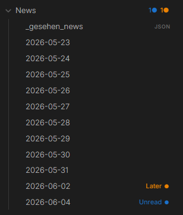
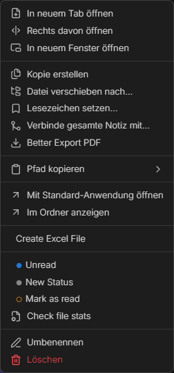
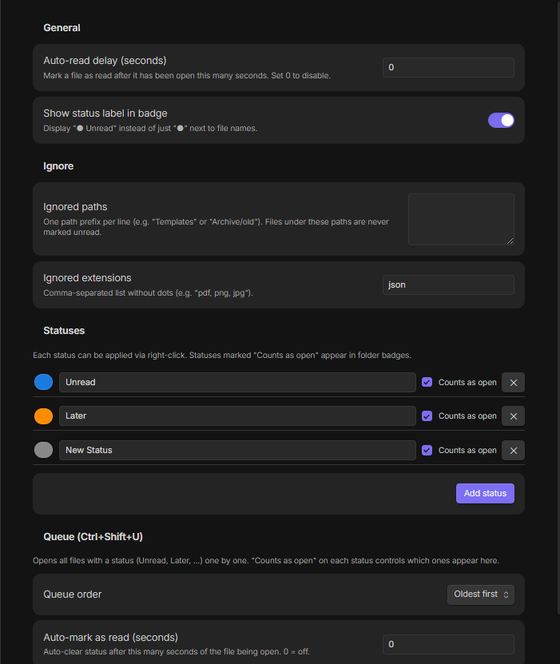

# Unread+

Track unread files in Obsidian. New files get a colored dot — folder badges propagate counts up the entire tree so you always know where to look, even in a collapsed vault.



---

## Features

**Colored dots** — Unread (blue) and Later (orange) by default. Fully customizable — add any status with any color.

**Folder badges** — each parent folder shows a per-status count (`1● 1●`) at every depth, even collapsed.

**Status bar** — total unread count visible at the bottom of Obsidian at all times.

**Dot aging** — fresh dots start at full opacity and fade slightly each day. Files you've been sitting on for a week look the part.

**Snooze** — right-click → Snooze 1 day / 3 days / 1 week. The dot disappears and comes back automatically when the time is up.

**Offline detection** — files created by scripts or sync tools while Obsidian was closed are picked up automatically on the next launch.

**Open Next Unread** — `Ctrl+Shift+U` opens all unread files one by one until the queue is empty.

**Colored context menu** — each status shows its own colored circle. No guessing.



---

## Installation

1. Download `main.js`, `manifest.json`, `styles.css` from the [latest release](../../releases/latest)
2. Copy to `.obsidian/plugins/unread-plus/` in your vault
3. Settings → Community Plugins → enable **Unread+**

```bash
# From source
git clone https://github.com/kashicards/unread-plus.git
cd unread-plus && npm install && npm run build
```

---

## Usage

| Action | How |
|--------|-----|
| Set status | Right-click file → pick status |
| Clear status | Right-click → Mark as read |
| Snooze | Right-click → Snooze 1 day / 3 days / 1 week |
| Open next unread | `Ctrl+Shift+U` |
| Mark all as read | Command palette → *Mark all as read* |

---

## Settings



- **Auto-read delay** — auto-clear status after N seconds of the file being open
- **Show label in badge** — display `Unread ●` instead of just `●`
- **Ignored paths / extensions** — never track certain folders or file types (`json` excluded by default)
- **Statuses** — add, rename, recolor; "Counts as open" controls folder badges and queue inclusion
- **Queue** — order and auto-mark behavior for `Ctrl+Shift+U`
