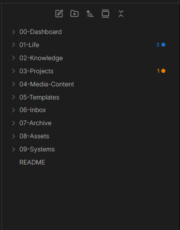
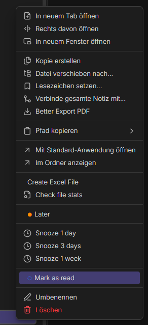
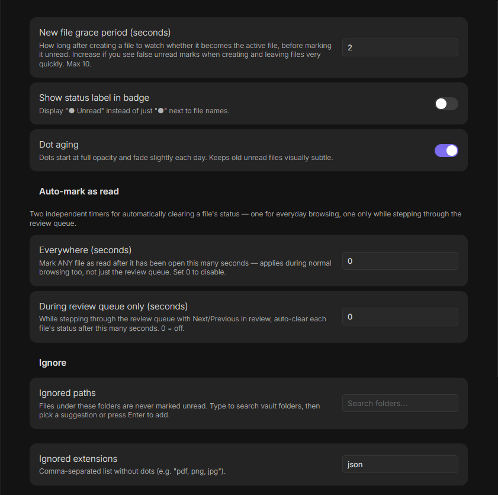

# Unread+

Track unread files in Obsidian. New files get a colored dot — folder badges propagate counts up the entire tree so you always know where to look, even in a collapsed vault.



---

## Features

**Colored dots** — Unread (blue) and Later (orange) by default. Fully customizable — add any status with any color, and optionally a custom icon/emoji instead of the default dot.

**Folder badges** — each parent folder shows a per-status count (`1● 1●`) at every depth, even collapsed. Hover a segment to see which status it is.

**Status bar** — total unread count visible at the bottom of Obsidian at all times.

**Dot aging** — fresh dots start at full opacity and fade slightly each day. Files you've been sitting on for a week look the part.

**Snooze** — right-click → Snooze 1 day / 3 days / 1 week. The dot disappears and comes back automatically when the time is up. All currently snoozed files are also listed in Settings, with remaining time and a one-click unsnooze.

**Offline detection** — files created by scripts or sync tools while Obsidian was closed are picked up automatically on the next launch, with a configurable grace period so files you create and edit yourself very quickly aren't mistakenly flagged.

**Open Next/Previous Unread** — `Ctrl+Shift+U` steps through unread files one by one, showing progress ("3 of 12"). Step back with the *Previous in review* command if you went too far.

**Colored context menu** — each status shows its own colored circle. No guessing.



**Unread overview codeblock** — embed a live, filterable overview of your unread/later files directly in any note (e.g. a daily-note template):

````markdown
```unread-overview
status: unread, later
folder: Projects
limit: 5
sort: age
```
````

<!-- Bild einfügen: docs/preview-overview-codeblock.png — Beispiel-Notiz mit eingebettetem unread-overview Codeblock (Stats-Chips + Liste) -->

---

## Installation

1. Download `main.js`, `manifest.json`, `styles.css` from the [latest release](../../releases/latest)
2. Copy to `.obsidian/plugins/unread-plus/` in your vault
3. Settings → Community Plugins → enable **Unread+**

On first install, a short welcome modal explains dots, folder badges, and right-click statuses.

<!-- Bild einfügen: docs/preview-onboarding.png — Onboarding-Modal beim ersten Start -->

```bash
# From source
git clone https://github.com/kashicards/unread-plus.git
cd unread-plus && npm install && npm run build
```

---

## Usage

| Action | How |
|--------|-----|
| Set status | Right-click file → pick status |
| Set selected files unread | Select files → right-click → Mark selected as Unread |
| Clear selected files | Select files → right-click → Mark selected as read |
| Clear status | Right-click → Mark as read |
| Snooze | Right-click → Snooze 1 day / 3 days / 1 week |
| Open next unread | `Ctrl+Shift+U` |
| Open previous unread | Command palette → *Previous in review* |
| Mark all as read | Command palette → *Mark all as read* |

---

## Settings



<!-- Bild aktualisieren: docs/preview-settings.png — zeigt noch nicht die neuen Felder (Icon-Eingabe, Drag-Handle, "New file grace period", "Reset to defaults") -->

- **Auto-read delay** — auto-clear status after N seconds of the file being open
- **New file grace period** — how long a newly created file is watched for becoming active before it's marked unread (protects fast create → paste → switch-away workflows)
- **Show label in badge** — display `Unread ●` instead of just `●`
- **Ignored paths / extensions** — never track certain folders or file types. Folder paths are typed with autocomplete suggestions from your vault; `json` is excluded by default.
- **Statuses** — add, rename, recolor, give each an optional icon/emoji, and reorder them by drag-and-drop. "Counts as open" controls folder badges and queue inclusion. Deleting a status asks for confirmation and shows how many files are affected.

<!-- Bild einfügen: docs/preview-status-list.png — Status-Liste mit Icon-Feldern und Drag-Handles -->

- **Snoozed files** — overview of every currently snoozed file with remaining time and a one-click unsnooze button.

<!-- Bild einfügen: docs/preview-snooze-list.png — Snooze-Übersicht in den Settings -->

- **Queue** — order and auto-mark behavior for `Ctrl+Shift+U`
- **Reset to defaults** — resets all settings and statuses back to their defaults, behind a confirmation dialog
